# Fundamentos de Ingeniería de Software
# Obligatorio 1
___Versión 1.0___

**N4A, Docente: Gerardo Quintana.**

**Integrantes: Cristian Palma, Federico Alonso, Valeria Vera.**

15 de octubre de 2020

**URL del repositorio: https://github.com/ORT-FIS-202008/ob1-alonso-palma-vera-1**

# ÍNDICE

### 1. [PREFACIO](#I1)
### 2. [GLOSARIO](#I2)
### 3. [INVESTIGACIÓN](#I3)
- ### 3.1. [Actividades realizadas](#I31)
    - ### 3.1.1. [Resultado obtenidos](#I311)
    - ### 3.1.2. [Modelo de Usuarios del Sistema](#I312)
        - ### 3.1.2.1. [Usuarios de internet sin autenticar](#I3121)
        - ### 3.1.2.2. [ User persona alumno](#I3122)
    - ### 3.1.3. [Interesados o stakeholders](#I313)
        - ### 3.1.3.1. [Profesor de Guitarra que genera contenido para el sistema](#I3131)
        - ### 3.1.3.2. [Administrador del sistema](#I3132)
        - ### 3.1.3.3. [Alumnos](#I3133)
        - ### 3.1.3.4. [Padres y/o tutores](#I3134)
        - ### 3.1.3.5. [Equipo de desarrollo](#I3135)
        - ### 3.1.3.6. [Otros profesores de Guitarra](#I3136)
        - ### 3.1.3.7. [Plataformas online donde dan clases de guitarra](#I3137)
        - ### 3.1.3.8. [Usuarios que no son alumnos](#I3138)
- ### 3.2. [Determinación del sistema](#I32)
    - ### 3.2.1. [Objetivo del sistema](#I321)
    - ### 3.2.2. [Restricciones](#I322)
    - ### 3.2.3. [Alcance del producto](#I323)
    - ### 3.2.4. [Requerimientos de Usuario](#I324)
    - ### 3.2.5. [Requerimientos del sistema](#I325)
### 4. [ESPECIFICACIÓN](#I4)
- ### 4.1. [Diccionario de Datos](#I41)
    - ### 4.1.1. [DatosUsuario](#I411)
    - ### 4.1.2. [DatosCurso](#I412)
    - ### 4.1.3. [DatosVideo](#I413)
    - ### 4.1.4. [DatosHistorial](#I414)
- ### 4.2. [Diagrama de contexto](#I42)
- ### 4.3. [Diagrama del dominio](#I43)
- ### 4.4. [Diagrama de casos de uso](#I44)
- ### 4.5. [Negociación y priorización de requerimientos](#I45)
    - ### 4.5.1. [Requerimientos Funcionales](#I451)
    - ### 4.5.2. [Requerimientos No Funcionales](#I452)
- ### 4.6. [USER STORIES](#I46)
    - ### 4.6.1. [User Story 01 Alta Usuario](#I461)
    - ### 4.6.2. [User Story 12 Ver Video](#I462)
    - ### 4.6.3. [User Story 05 Alta Curso](#I463)
- ### 4.7. [CASOS DE USO](#I47)
    - ### 4.7.1. [Caso de Uso 01 Alta Usuario](#I471)
    - ### 4.7.2. [Caso de Uso 12 Ver Video](#I472)
    - ### 4.7.3. [Caso de Uso 05 Alta Curso](#I473)
- ### 4.8. [REQUERIMIENTOS FUNCIONALES](#I48)
    - ### 4.8.1. [Gestión de usuarios](#I481)
    - ### 4.8.2. [Autenticación de usuarios](#I482)
    - ### 4.8.3. [Gestión de cursos](#I483)
    - ### 4.8.4. [Gestión de videos](#I484)
    - ### 4.8.5. [Visualización de contenido](#I485)
    - ### 4.8.6. [Histórico de reproducciones](#I486)
- ### 4.9. [REQUERIMIENTOS NO FUNCIONALES](#I49)
### 5. [VERIFICACIÓN Y VALIDACIÓN DE REQUERIMIENTOS](#I5)
- ### 5.1. [VERIFICACIÓN](#I51)
- ### 5.2. [VALIDACIÓN](#I52)
    - ### 5.2.1. [Primera reunión](#I521)
    - ### 5.2.2. [Segunda reunión](#I522)
    - ### 5.2.3. [Tercera reunión](#I523)
### 6. [REFLEXIÓN](#I6)

# 1. PREFACIO 

El presente documento está redactado de forma tal que se entienda la trazabilidad de los trabajos realizados para recabar las necesidades del cliente. Comenzando con lenguaje natural y volviéndose técnico a medida que avanza el documento, tornándose complejo para el usuario final, pero sencillo de entender al grupo de desarrollo que posteriormente realizará el trabajo pertinente.

El modelo de proceso de software a utilizar será el desarrollo incremental, en el cual nos comunicaremos periódicamente con el cliente, a efectos de aclarar dudas e ir mostrando avances (versiones de la pieza de software), de esta forma nos aseguraremos de brindar la solución necesaria, y no desviarnos del trabajo deseado. A su vez el cliente corroborará el trabajo efectuado por el equipo y cada versión añadirá funcionalidad a la versión anterior.

El Proyecto lo versionaremos de forma tradicional, asignando dos números, los cuales irán incrementando conforme el desarrollo del software, comenzando desde la v1.0.
Estos números aumentan cuando:
- Mayor: el software sufre grandes cambios y mejoras.
- Menor: el software sufre pequeños cambios y/o correcciones de errores.

Los archivos que formarán parte del documento se referenciarán de la siguiente forma:
Número de referencia del documento: APV-ob1-Z-NNNN, donde:
- APV es el identificador de la empresa de software (Alonso-Palma-Vera)
- ob1 es el identificador del proyecto
- Z es un identificador en lenguaje natural del elemento 
- NNNN es el año. 

# 2. GLOSARIO 

Se especifíca la terminología utilizada a lo largo del documento:

- *Software:* Conjunto de programas que permiten a la computadora realizar determinadas tareas
- *Ingenieria inversa:* Proceso llevado a cabo con el objetivo de obtener información o un diseño a partir de un producto, con el fin de determinar cuáles son sus componentes y de qué manera interactuan entre si.
- *Usuario*: Persona que utiliza el sistema.
- *Usuario final*: Persona o personas que van a manipular de manera directa un producto de software
- *Usuario administrador del sitio*: Usuario encargado de la configuración del sistema
- *Usuario autenticado*: Usuario del sistema que tiene una sesión activa.
- *Responsive*: Diseño de página web que se adapta de forma automática a la resolución de la pantalla donde está siendo visualizado y a diferentes tipos de dispositivos.
- *Baja usuario:* Eliminar a un usuario permanentemente de un sistema.
- *Alta usuario:* Dar acceso a un usuario a un sistema o a algunas caracteristicas de un sistema.
- *Autenticar:* Autorizar a un usuario a ingresar a un sistema.
- *Plataforma:* Sistema que permite la ejecución de diversas aplicaciones bajo un mismo entorno, dando a los usuarios la posibilidad de acceder a ellas a través de Internet.
- *Diagrama de dominio:*  Se describen las distintas entidades, sus atributos, papeles y relaciones, además de las restricciones que rigen el dominio del problema.
- *Diagrama de contexto:* Diagrama que representa todas las entidades externas que podráan interactuar con un sistema.
- *User story:* Describe una funcionalidad simple y atómica que será de valor para un usuario o comprador de un sistema o software.
- *Caso de uso:* Secuencia de transacciones que son desarrolladas por un sistema en respuesta a un evento que inicia un actor sobre el propio sistema
- *Diagrama de casos de uso:* Diagrama que muestra la relación entre los actores y los casos de uso en un sistema.
- *Requerimiento:* Condición o capacidad de un sistema requerida por el usuario para resolver un problema o alcanzar un objetivo
- *Requerimiento funcional:*  Descripción del comportamiento del sistema en condiciones específicas
- *Requerimiento no funcional:* Restricciones a los servicios provistos por el sistema y/o atributos de calidad del mismo.

# 3. INVESTIGACIÓN 

## 3.1 Actividades realizadas

Para comenzar, posterior a recibir la orden de trabajo y previo al contacto con el cliente, se comenzó a indagar sobre cómo se debía abordar la investigación. En ese momento se contaba con la información de que era un sistema para que los niños aprendan a tocar guitarra online, siendo nuestro cliente el profesor a cargo de impartir las clases. El cliente impartia clases presenciales a niños antes de comenzar la pandemia,  su hijo (quien nos contactó) es quien realizaba toda la administración, y debido a la emergencia sanitaria tuvieron que dejar de dar clases, perdiendo de esta forma una fuente de ingreso extra.

Resultante de la información recibida, se visualiza de forma rápida contenido relacionado con la enseñanza de guitarra (a efectos de informarse sobre los términos utilizados en las mismas: acordes, partituras, videos explicativos, afinación, tipos de guitarra, etc.), y se prepara una entrevista primaria a los principales involucrados (el profesor de guitarra y su hijo), abordando con uno los requerimientos del área de educación y con el otro los de la administración del negocio.

Como el cliente está bien definido y son dos personas particulares se decide realizar entrevistas, pudiendo de esta forma enfocarnos en los problemas que ellos desean que podamos resolver. Las mismas aparecen en los documentos [Entrevista 1](APV-ob1-Entrevista1-2020.md) y [Entrevista 2](APV-ob1-Entrevista2-2020.md)
 
Además como dato resultante de la entrevista con el hijo del cliente, se obtuvo una página web de su interés, por lo que se aplicó el método de [Ingeniería reversa](APV-ob1-IngenieriaReversa-2020.md) para así poder obtener un mejor detalle de las expectativas del cliente. 

Estudiando lo anterior se extraen diferentes roles de usuarios que participarán con el sistema, los cuales se detallarán en las siguienes secciones.

### 3.1.1 Resultados Obtenidos
Luego de realizar las tareas de investigación se determina que el sistema de mayor conveniencia es el desarrollo de una aplicación web, en la cual se carguen las lecciones del profesor y sus alumnos puedan ver las mismas desde su hogar. 

Para lo mismo se establecen tres actores:

- Niño: Accederá al sistema, y recibirá las clases grabadas con anterioridad.
- Usuario no Autenticado: Accederá a la página por algún medio, y podrá ver la información pública del sitio, sin poder acceder a la sección privada del mismo.
- Administrador: Se encargara de subir y organizar las clases y cursos, también de validar el acceso de los usuarios al sistema.

### 3.1.2 Modelo de Usuarios del Sistema 
En la presente sección estudiaremos a los actores del sistema. A efecto de complementar la información recabada en las entrevistas, y basándonos en ellas, utilizaremos la técnica de la User Persona. Crearemos un personaje ficticio de niño y uno de usuario no autenticado para que, por medio de la empatía, recabar información complementaria. No realizaremos una User Persona del administrador, debido a que el mismo es una persona específica y trabajaremos directamente con él validando posteriormente los requerimientos.

#### 3.1.2.1 Usuarios de internet sin autenticar 
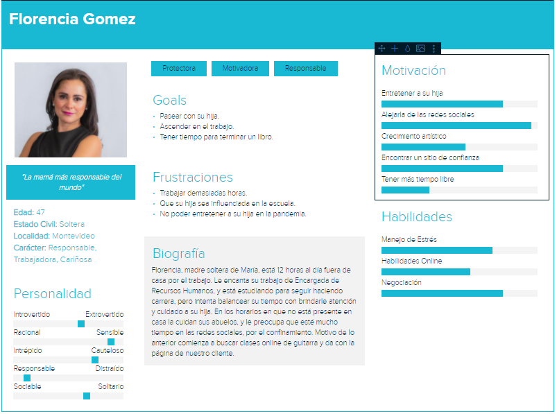

Los usuarios sin autenticar son personas que a través del marketing llegaron a la URL del sistema.

Pueden visitar las páginas de acceso público, las mismas deben mostrar aspectos personales que generen confianza en quien visita al sistema.

Debe existir una forma rápida de poner en contacto al usuario no autenticado con el administrador del sitio para concretar la inscripción al sistema.

#### 3.1.2.2 User persona alumno 

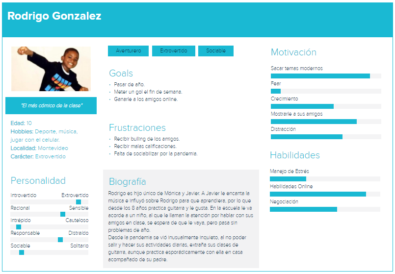

Los alumnos, específicamente niños entre 8 y 12 años, se van a autenticar en el sistema con un usuario y contraseña previamente suministrada por el administrador.

Una vez autenticados, van a poder navegar en la página, seleccionar cursos de guitarra y mirar las clases online. 

Ya que se pueden distraer, tendrán una forma rápida de acceso a la clase que continúa en su curso.

El sistema guardará las clases que fueron reproducidas por el alumno, a efectos de mostrar a sus padres un resumen del progreso.

### 3.1.3 Interesados o stakeholders 

En esta sección vamos a identificar y clasificar los interesados o stakeholders:

1.	**Internos**

    - Profesor de Guitarra que genera contenido para el sistema.
    - Administrador del sistema.
    - Alumnos.
    - Padres / tutores de los alumnos.
    - Equipo de desarrollo.

2.	**Externos**

    - Otros Profesores de guitarra.
    - Plataformas online donde dan clases de guitarra.
    - Usuarios que no son alumnos.

#### 3.1.3.1 Profesor de Guitarra que genera contenido para el sistema 

Tiene la responsabilidad de generar cursos de guitarra orientado a niños entre 8 a 12 años. Tiene un alto interés en el proyecto porque a causa de la pandemia no pudo continuar dando clases de manera presencial. Es uno de los interesados más importantes, ya que de la calidad de sus clases atraerá o no alumnos.

#### 3.1.3.2 Administrador del sistema 

Tiene la responsabilidad de subir el contenido generado por el profesor a la plataforma online. Está a cargo de la gestión de usuarios con rol Alumno. Habilita o deshabilita de la plataforma a los usuarios alumnos dependiendo si están al día con el pago de la cuota. Recibe consultas administrativas mediante los datos de contacto presentes en la plataforma, de usuarios que no son alumnos. Tiene un interés positivo en el avance del proyecto, ya que el percibe un beneficio en base a la cantidad de alumnos registrados.

#### 3.1.3.3 Alumnos 

Son los niños de 8 a 12 años que son usuarios del sistema. Lograr captar la atención de estos hará la diferencia entre el éxito o fracaso del proyecto. Tienen interés positivo en el proyecto ya que desean seguir aprendiendo a pesar de la restricción de la pandemia.

#### 3.1.3.4 Padres y/o tutores 

Son los responsables legales de los Alumnos. Tienen interés positivo en el proyecto ya que de ser exitoso se benefician en lo siguiente:

- Ahorro de tiempo en traslado a la clase presencial.
- Flexibilidad de horario, ya que al ser una clase grabada puede elegir el momento adecuado para darle acceso a hijo.

#### 3.1.3.5 Equipo de desarrollo 

Se omite por no tener relevancia en este caso.

#### 3.1.3.6 Otros profesores de Guitarra 

Estos profesores tienen interés positivo en el proyecto, ya que se encentran en la misma situación por causa de la pandemia. En etapas mas avanzas del proyecto, podrían estar interesados en subir su propio contenido y tener su grupo de alumnos utilizando la misma plataforma.

#### 3.1.3.7 Plataformas online donde dan clases de guitarra 

Estos interesados no tienen interés positivo en el proyecto, por tratarse de competencia directa en el mercado.

#### 3.1.3.8 Usuarios que no son alumnos 

Son los usuarios que llegan a la plataforma producto del marketing, tienen interés en el sistema, ya que al ingresar a la misma, significa que están buscando un servicio similar al que la plataforma ofrece, convirtiéndose de esta forma en potenciales clientes.

## 3.2 Determinación del sistema 
### 3.2.1 Objetivo del sistema 

El objetivo del producto es crear una plataforma que cumple dos funciones básicas, la primera es brindar al cliente un marco para publicar su servicio, de forma de que usuarios no registrados puedan comunicarse con él para acceder al mismo. A su vez, también funciona para que puedan distribuir cursos a niños los que previamente solicitaron su acceso y fueron autorizados.

Los accesos al sistema serán gestionados por un administrador que recibirá los pagos por un medio externo a la aplicación, y controlará los mismos de forma manual, a efectos de tener flexibilidad con los distintos clientes. El sistema debe estar adaptado a dispositivos móviles ya que los niños tienen un amplio dominio y uso de los mismos.

### 3.2.2 Restricciones 

- El sistema deberá ser desarrollado en 30 días contando a partir del momento que se firma el documento de requerimientos de software (que no puede superar la fecha 15 de octubre del corriente año).
- El costo total del desarrollo no podrá superar los USD 1000.

### 3.2.3 Alcance del producto 

El software a desarrollar permite la baja, alta y visualización de videos. Alta, baja y asignación de videos a diferentes cursos existentes en el sistema, así como un histórico de reproducciones para los alumnos.

También debe de estar diferenciadas dos secciones básicas: 
- Una pública para el acceso al sistema sin estar autenticado.
- Una privada para la administración y visualización de contenidos para usuarios autorizados.

Existen dos tipos de usuarios autorizados que utilizán el sistema para diferentes tareas, usuario alumno y usuario administrador.

### 3.2.4 Requerimientos de Usuario 

- Un Usuario no autenticado podrá acceder a información relevante del sitio.
- Un Usuario administrador puede administrar a otros usuarios que cumplirán el rol de alumnos.
- El Usuario administrador puede gestionar cursos en el sistema.
- El Usuario de tipo alumno puede ver los cursos del sistema y sus videos.
- El Usuario de tipo alumno puede acceder a su historial de videos vistos.

### 3.2.5 Requerimientos del sistema 

- **Sección Pública**
    - Un usuario no autenticado puede ver la información de contacto.
- **Gestión de usuarios**
    - El Usuario administrador puede dar de alta a usuarios de tipo alumno.
    - El Usuario administrador puede dar de baja a usuarios de tipo alumno.
    - El Usuario administrador puede habilitar o deshabilitar el acceso a los cursos de los usuarios de tipo alumno.
- **Gestión de cursos**
    - El Usuario administrador puede dar de alta nuevos cursos al sistema.
    - El Usuario administrador puede dar de baja cursos existentes en el sistema.
    - El Usuario administrador puede dar de alta videos y asociarlos a un curso específico.
    - El Usuario administrador puede dar de baja videos asociados a un curso específico.
- **Visualización del contenido**
    - El Usuario alumno puede ver la lista de cursos disponibles en el sistema.
    - El Usuario alumno puede seleccionar un curso específico del sistema.
    - El Usuario alumno puede ver los videos correspondientes a un curso seleccionado.
- **Histórico de reproducciones**
    - El Usuario alumno puede ver su historial de videos vistos.

# 4. ESPECIFICACIÓN  
## 4.1 Diccionario de Datos 
### 4.1.1 DatosUsuario 
- **Descripción:** Datos que contendrá el usuario.

|Campo      |Tamaño  |Tipo                  |Descripción                                                   |
|-----------|--------|----------------------|--------------------------------------------------------------|
|Email      |25      |Caracter              |Clave única, email del usuario                                |
|Contraseña |8       |Caracter              |Cadena de caracteres que permite el acceso junto con el email |
|Nombre     |50      |Caracter              |Nombre del usuario                                            |
|Apellido   |50      |Caracter              |Apellido del usuario                                          |
|Telefono   |15      |Caracter              |Teléfono del usuario                                          |
|Habilitado |2       |Booleano              |True si está habilitado a acceder al sistema, False si no     |

- **Claves:** Nombre.
- **Relación:** Email con DatosHistorial.

### 4.1.2 DatosCurso 
- **Descripción:** Datos que contendrá el curso.

|Campo       |Tamaño  |Tipo                  |Descripción                                                   |
|------------|--------|----------------------|--------------------------------------------------------------|
|Nombre      |10      |Caracter              |Clave única, nombre del curso                                 |
|Descripción |200     |Caracter              |Descripción del curso                                         |
|Nivel       |20      |Caracter              |Nivel del curso (principiante, intermedio o avanzado)         |
|Habilitado  |2       |Booleano              |True si está habilitado a acceder al público, False si no     |

- **Claves:** Nombre.
- **Relación:** Nombre con DatosVideo NombreCurso.

### 4.1.3 DatosVideo 
- **Descripción:** Datos que contendrá el video.

|Campo       |Tamaño  |Tipo                  |Descripción                                                   |
|------------|--------|----------------------|--------------------------------------------------------------|
|ruta        |10      |Caracter              |Clave única, ruta del video                                   |
|NombreCurso |10      |Caracter              |Clave foránea, nombre del curso al que pertenece              |

- **Claves:** NombreCurso, ruta.
- **Relación:** NombreCurso con DatosCurso Nombre.

### 4.1.4 DatosHistorial 
- **Descripción:** Datos que contendrá el historial.

|Campo       |Tamaño  |Tipo                  |Descripción                                                   |
|------------|--------|----------------------|--------------------------------------------------------------|
|ruta        |10      |Caracter              |Clave foránea, ruta del video visto por el alumno             |
|Email       |25      |Caracter              |Clave foránea, email del alumno                               |
|Porcentaje  |100     |Numérico              |Valor en partes por 100 de reproducción de un video           |

- **Claves:** ruta, Email.
- **Relación:** ruta con DatosVideo, Email con DatosUsuario.

## 4.2 Diagrama de contexto 
A continuación se representa el sistema en un diagrama en el cual, de forma abstracta, se observa la relación entre el sistema y todas las entidades externas que pueden interactuar con el mismo.

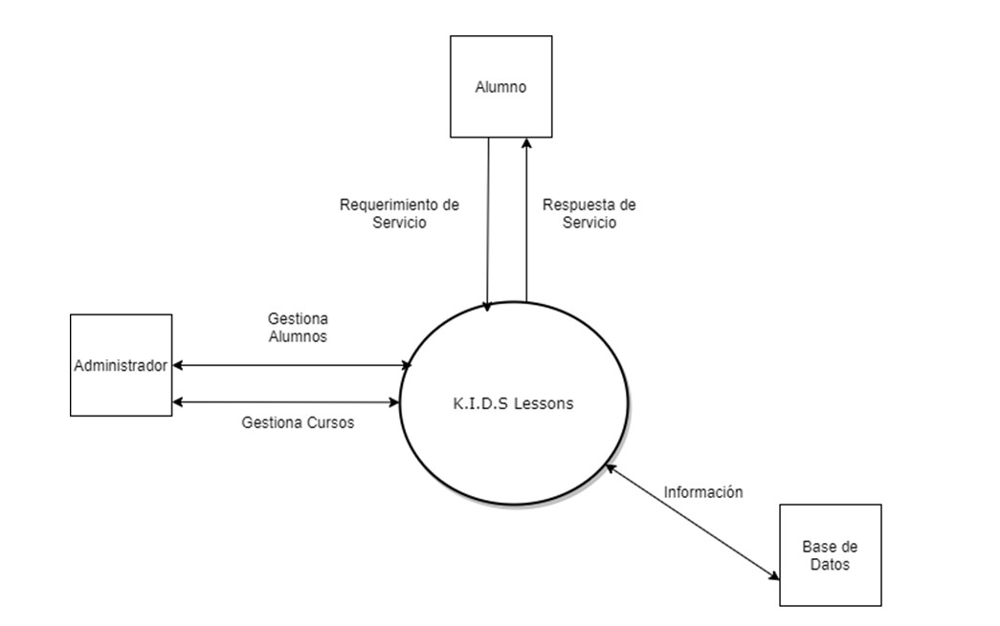

## 4.3 Diagrama del dominio 
El diagrama del dominio nos permite identificar y explicar los conceptos más significativos en el dominio del problema, sus atributos y asociaciones existentes entre ellos, del dominio de interes que forma parte del marco del sistema. Nos permite representar todos los elementos interrelacionados que son necesarios para enteder correctamente el negocio del cliente y sus necesidades, y proponer una solucion adecuada a sus problemas.
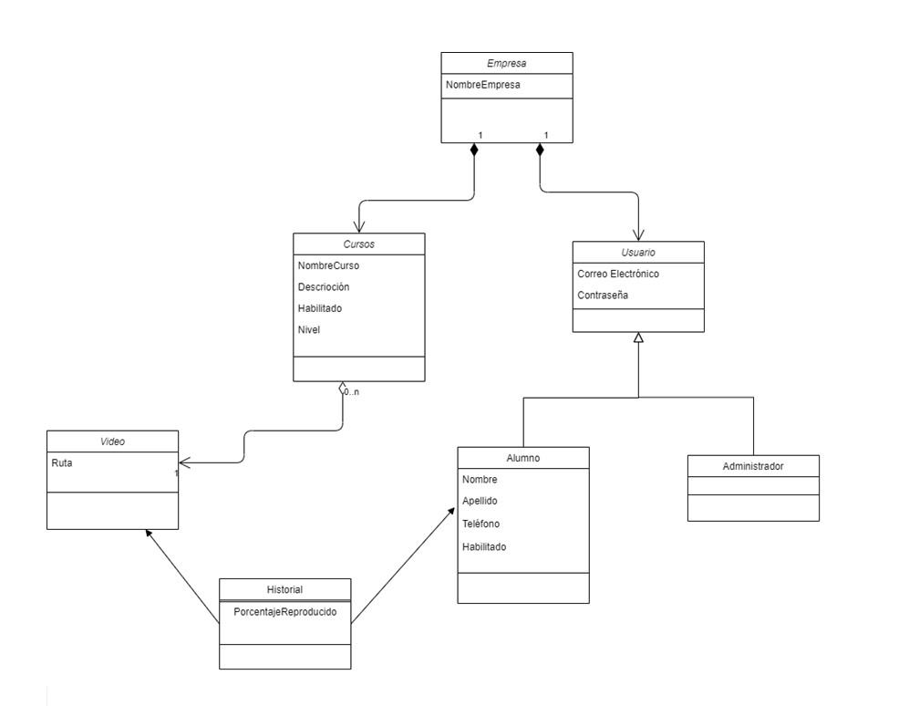

## 4.4 Diagrama de casos de uso 
A continuación diagramaremos el comportamiento del sistema para con los usuarios, donde se utiliza una representacion gráfica para modelar los casos de uso. Se muestran los casos de uso como parte del sistema que está siendo modelado y las relaciones entre los mismos.
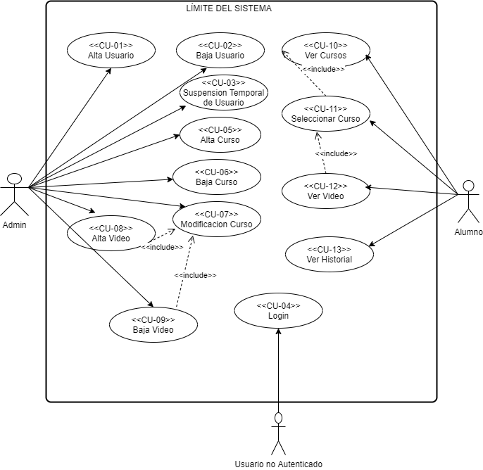

## 4.5 Negociación y priorización de requerimientos 
En esta sección procederemos a priorizar los requerimientos, de esta forma podremos definir cuáles son de mayor importancia y cuáles más triviales. Utilizaremos la técnica de ranking está basada en una escala ordinal en la cuál a los requerimientos se les asigna una posición en el ranking, que va de 1 a 13, siendo 13 la cantidad de requerimientos funcionales. Y del 1 al 3 los requerimientos no funcionales.

El puesto 1 es el de mayor importancia.

Luego de elicitar los requerimientos, confeccionamos un listado de los 13 requerimientos funcionales y 3 requerimientos no funcionales detectados y se lo presentamos a Rodrigo Fernández, quien después de la investigación, determinamos que sería el interesado que más interacción iba a tener con el sistema.

### 4.5.1 Requerimientos Funcionales 
|# |Código |Nombre                        |Ranking|
|--|-------|------------------------------|-------|
|1 |RF01   |Alta Usuario                  |2      |
|2 |RF02   |Baja Usuario                  |13     |
|3 |RF03   |Suspención temporal de usuario|8      |
|4 |RF04   |Login                         |5      |
|5 |RF05   |Alta Curso                    |1      |
|6 |RF06   |Baja Curso                    |12     |
|7 |RF07   |Modificar Curso               |6      |
|8 |RF08   |Alta Video                    |4      |
|9 |RF09   |Baja Video                    |11     |
|10|RF10   |Consulta Cursos               |10     |
|11|RF11   |Seleccionar Curso             |7      |
|12|RF12   |Ver Video                     |3      |
|13|RF13   |Ver Historial                 |9      |

### 4.5.2 Requerimientos No Funcionales 
|# |Código  |Nombre                        |Ranking|
|--|--------|------------------------------|-------|
|1 |RFN01   |Diseño de Interfaz de Usuario |1      |
|2 |RFN02   |Informe de Errores            |2      |
|3 |RFN03   |Sistema                       |3      |

## 4.6 USER STORIES 
Aquí redactaremos tres historias de usuario que describen una funcionalidad simple y atómica de valor para dichos usuarios.

### 4.6.1 User Story 01 Alta Usuario 

**ID:** #1	

**Título:** Alta Alumno

**Narrativa:**

    - Como: administrador

    - Quiero: poder registrar a un nuevo alumno.

    - Para: que el mismo tenga acceso a utilizar las funcionalidades de la aplicación.

**Criterios de aceptación:**
- El email debe ser único, y válido.
- La contraseña debe ser alfanumérica de mínimo 8 caracteres, mayúsculas y minúsculas.
- Nombre completo deben de tener al menos 5 caracteres.
- Teléfono de contacto debe ser un campo numérico y por lo menos 8 cifras.

### 4.6.2 User Story 12 Ver Video 

**ID:** #12

**Título:** Ver Video

**Narrativa:**

    - Como: alumno

    - Quiero: poder continuar con la visualización de videos de un curso.

    - Para: poder seguir avanzando en el curso seleccionado.

**Criterios de aceptación:**
- El alumno debe estar autenticado con usuario y contraseña.
- El alumno debe estar habilitado.

### 4.6.3 User Story 05 Alta Curso 

**ID:** #5

**Título:** Alta Curso

**Narrativa:**

    - Como: administrador

    - Quiero: poder dar de alta un nuevo curso.

    - Para: posteriormente cargarle videos y poder presentárselo a los alumnos.

**Criterios de aceptación:**
- El nombre del curso debe ser único y poseer al menos 5 caracteres.
- El curso debe ser creado con el estado deshabilitado por defecto, ya que al momento de creación no posee videos asociados. 

## 4.7 CASOS DE USO 
Los casos de uso son una descripción generalizada de un conjunto de interacciones entre el sistema y uno o más actores, procederemos a describir los tres de mayor priorización, que son los que representan las User Story anteriores.

### 4.7.1 Caso de Uso 01 Alta Usuario 

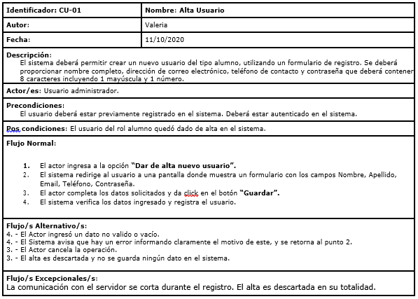

### 4.7.2 Caso de Uso 12 Ver Video 

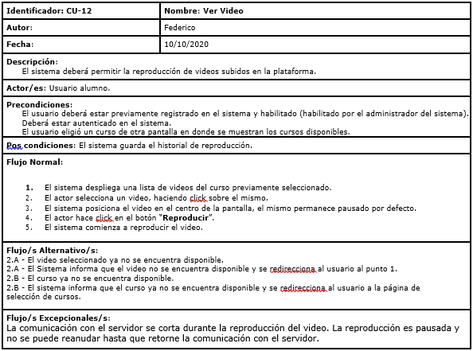

### 4.7.3 Caso de Uso 05 Alta Curso 

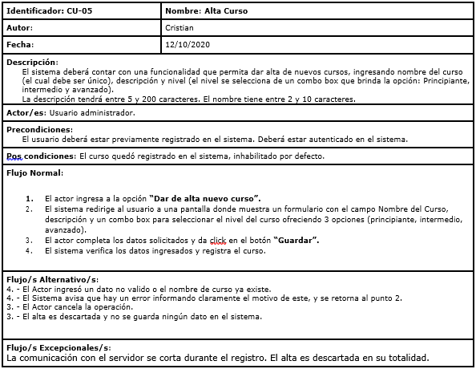

## 4.8 REQUERIMIENTOS FUNCIONALES 

### 4.8.1 Gestión de usuarios 

#### **RF01 - Alta de usuario**

- **Rol:** Administrador
- **Descripción:** El sistema deberá permitir crear un nuevo usuario del tipo alumno, utilizando un formulario de registro. Se deberá proporcionar nombre completo, dirección de correo electrónico, teléfono de contacto y contraseña que deberá contener 8 caracteres incluyendo 1 mayúscula y 1 número. 
- **Prioridad:** ALTA
- **Ranking:** #2
- **Especificación:** CU-01

#### **RF02 - Baja de usuario**

- **Rol:** Administrador
- **Descripción:** El sistema deberá permitir la eliminación permanente de usuarios del tipo alumno en el sistema. 
- **Prioridad:** BAJA
- **Ranking:** #13

#### **RF03 - Suspensión temporal de usuario**

- **Rol:** Administrador
- **Descripción:** El sistema deberá permitir cambiar el estado para que un usuario con el rol alumno pueda acceder o no acceder a la sección privada destinada únicamente a los alumnos habilitados.
Esta función no modifica ni elimina los otros atributos y relaciones con el histórico del usuario alumno.
Si un alumno que se encuentra suspendido intenta ingresar al sistema, se le notificará que se encuentra suspendido.
- **Prioridad:** MEDIA
- **Ranking:** #8

### 4.8.2 Autenticación de usuarios 

#### **RF04 - Login**

- **Rol:** Usuario no Autenticado
- **Descripción:** El sistema deberá detectar automáticamente solo con el nombre de usuario y contraseña que el usuario es del tipo administrador o tipo alumno. Al ingresar habilitará al usuario a acceder a las secciones correspondientes a su rol.
- **Prioridad:** ALTA
- **Ranking:** #5

### 4.8.3 Gestión de cursos 

#### **RF05 - Alta Curso**

- **Rol:** Administrador.
- **Descripción:** El sistema deberá contar con una funcionalidad que permita dar alta de nuevos cursos, ingresando nombre del curso (el cual debe ser único), descripción y nivel (el nivel se selecciona de un combo box que brinda la opción: Principiante, intermedio y avanzado).
La descripción tendrá entre 5 y 200 caracteres. El nombre tiene entre 2 y 10 caracteres.
- **Prioridad:** ALTA
- **Ranking:** #1
- **Especificación:** CU-05

#### **RF06 - Baja Curso**

- **Rol:** Administrador.
- **Descripción:** El sistema deberá contar con una funcionalidad que permita eliminar los cursos existentes. Se debe seleccionar el curso a eliminar y luego presionar "Eliminar", se solicitará confirmar la operación.
- **Comentarios:** No es posible eliminar un curso si el mismo tiene videos asociados.
- **Prioridad:** MEDIA
- **Ranking:** #12

#### **RF07 - Modificar Curso**

- **Rol:** Administrador.
- **Descripción:** El sistema deberá contar con una funcionalidad que permita modificar los cursos. El usuario administrador selecciona un curso. El sistema ofrece modificar el estado del curso, el nombre, la descripción y el nivel del curso.
- **Comentarios:** No es posible habilitar un curso que no tenga videos asociados. No es posible modificar el nombre de un curso si el nombre que se desea ya existe. 
- **Prioridad:** ALTA
- **Ranking:** #6

### 4.8.4 Gestión de videos 

#### **RF08 - Alta Video**

- **Rol:** Administrador.
- **Descripción:** El sistema será capaz de almacenar videos. El usuario hace click en el botón subir video y el sistema abre un cuadro de dialogo en donde el usuario selecciona un video de su ordenador. El video queda asociado al curso que el usuario administrador se encuentra modificando. 
- **Comentario:** El botón de subir video está disponible en la ventana de Modificar Curso del curso seleccionado. Cuando el video termina de subir, aparece visible en la ventana modificar curso. El video no podrá superar los 100 MB.
- **Prioridad:** ALTA
- **Ranking:** #4

#### **RF09 - Baja Video**

- **Rol:** Administrador.
- **Descripción:** El sistema será capaz de permitir al usuario administrador eliminar videos asociados a un curso. El usuario hace click en el botón eliminar video y luego confirma la eliminación. 
- **Comentario:** El botón de eliminar video está disponible en la ventana de Modificar Curso del curso seleccionado.
- **Prioridad:** MEDIA
- **Ranking:** #11

### 4.8.5 Visualización de contenido 

#### **RF10 - Consulta de cursos**

- **Rol:** Alumno.
- **Descripción:** El sistema deberá mostrar la lista de cursos disponibles que se encuentren habilitados para los usuarios con el rol alumno.
- **Prioridad:** ALTA
- **Ranking:** #10

#### **RF11 - Seleccionar curso**

- **Rol:** Alumno.
- **Descripción:** El sistema deberá permitir seleccionar un curso. Luego de que el usuario selecciona el mismo, se mostrará en otra ventana los videos asociados al curso seleccionado.
- **Prioridad:** ALTA
- **Ranking:** #7

#### **RF12 - Ver video**

- **Rol:** Alumno.
- **Descripción:** El sistema deberá permitir la reproducción de videos subidos en la plataforma.
- **Comentario:** Para seleccionar un video a ser reproducido, se debe estar dentro de un curso seleccionado, el porcentaje de reproducción se guarda en un historial asociado al usuario alumno.
- **Prioridad:** ALTA
- **Ranking:** #3
- **Especificación:** CU-12

### 4.8.6 Histórico de reproducciones 

#### **RF13 - Ver Historial**

- **Rol:** Alumno.
- **Descripción:** El Sistema será capaz de mostrar al usuario alumno la lista de videos que ha reproducido y el porcentaje de reproducción de los mismos.
- **Comentario:** Para seleccionar un video a ser reproducido, se debe estar dentro de un curso seleccionado.
- **Prioridad:** ALTA
- **Ranking:** #9

# 4.9 REQUERIMIENTOS NO FUNCIONALES 

#### **RNF01 - Diseño de Interfaz de Usuario**

- **Descripción:** La interfaz de usuario debe ser responsive (se debe adaptar a dispositivos web y móviles).
- **Categoría:** Usabilidad.
- **Prioridad:** Alta 
- **Ranking:** #1

#### **RNF02 - Informe de Errores**

- **Descripción:** El sistema deberá informar en forma detallada los errores que surjan durante la ejecución del programa con el objetivo de retroalimentar al usuario.
- **Categoría:** Usabilidad.
- **Prioridad:** Alta
- **Ranking:** #2
#### **RNF6 - Sistema**

- **Descripción:** El sistema debe correr en internet Explorer versión 10 o superior, Google Chrome versión 76 o superior, Safari 5.1.10 o superior y Mozilla Firefox 77.01 o superior.
- **Categoría:** Funcionalidad
- **Prioridad:** Media
- **Ranking:** #3

# 5. VERIFICACIÓN Y VALIDACIÓN DE REQUERIMIENTOS 

## 5.1 VERIFICACIÓN 

Para verificar los requerimientos del sistema se utilizá la técnica revisión de pares, porque se determinó que era la más adecuada porque se requiere poco tiempo y recursos (teniendo en cuenta las limitaciones del proyecto en tiempo y costo).

El objetivo de esta verificación fue determinar que todos los requerimientos cumplieran con las siguientes características deseables como, por ejemplo:

- Completo, correcto, factible, necesario, priorizado, no ambiguo y verificable.
- Consistente, modificable y trazable.

Cada requerimiento se consideró como un artefacto de software y para la verificación de estos, efectuamos la revisión de a pares entre dos miembros del equipo del obligatorio y el estudio detallado se encuentra en el documento [Verificación de requerimientos](APV-ob1-VerificacionRequerimientos-2020.md).

## 5.2 VALIDACIÓN 

Para la validación de requerimientos se utilizá la técnica de prototipado, la cual fue realizada mediante 3 reuniones de forma presencial con el cliente.

### 5.2.1 Primera reunión 

Se le presenta al cliente dos alternativas de interfaz de usuario, se pueden los prototipos completos en el documento: [Documento Primera Reunión ](APV-ob1-PrototipadoPrimeraReunion-2020.md) 

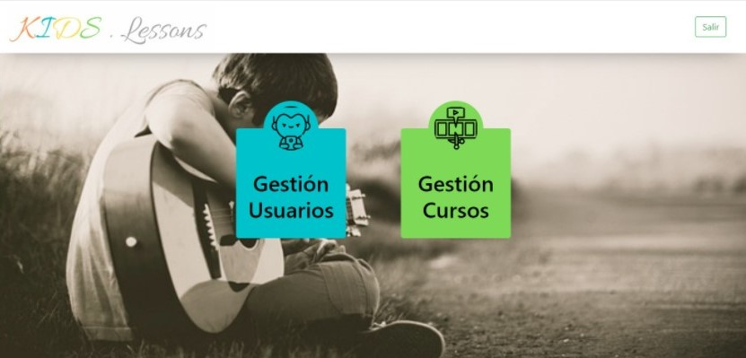

#### Retroalimentación de la primera reunión:

El cliente se inclinó por el prototipo 2 y realizó para cada imagen del documento APV-ob1-PrototipadoPrimeraReunion-2020 las siguientes observaciones:

- Figura 16: Se cambia la columna habilitado,para que muestre en cada fila un botón que al presionarlo cambia el estado del alumno entre habilitado y deshabilitado.
- Figura 18: A la descripción del video, se le agrega el curso al cual pertenece y el nivel de dicho curso.
- Figura 19: Se agrega el curso a la cual pertenece la clase.
- El cliente, además de las páginas mostradas en el prototipo solicitó que se agregue una nueva página en la cual se muestren todos los cursos de la plataforma.

### 5.2.2 Segunda reunión 

Se agregan, además de los cambios solicitados, los modelos de formularios para simular la implementación de los requerimientos. El estudio detallado se encuentra en el archivo: [Documento Segunda Reunión ](APV-ob1-PrototipadoSegundaReunion-2020.md).

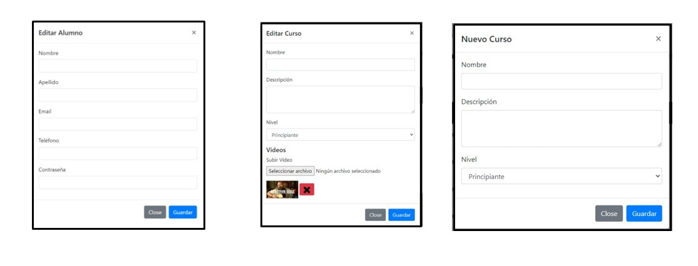 

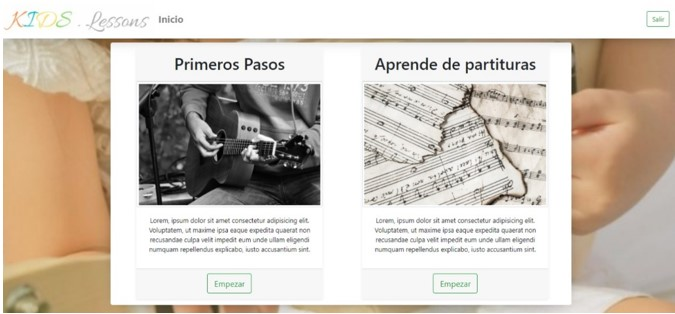 

#### Retroalimentación de la segunda reunión:

- En los formularios cambiar el texto del botón Close por Cerrar.
- En el formulario 2, cambiar el diseño del video en miniatura junto al botón de eliminar. Al cliente no le pareció estático.

Se obtuvo un feedback suficiente para diseñar un prototipo evolutivo en HTML, el cual será utilizado en una tercera reunión.

### 5.2.3 Tercera reunión 

En la [Tercera Reunión ](APV-ob1-PrototipadoTerceraReunion-2020.md) se le presenta al cliente un prototipo evolutivo en HTML, que le permitió ver al cliente como funcionan los requisitos solicitados al implementarlos, obteniendo de esta manera una validación más precisa.

El cliente experimentó con el prototipo tanto como [Usuario no Autenticado](http://htmlpreview.github.com/?https://github.com/federicoalonso/preEntrega/blob/main/APV-ob1-Prototipos-HTML-2020/index.html), [Alumno](http://htmlpreview.github.com/?https://github.com/federicoalonso/preEntrega/blob/main/APV-ob1-Prototipos-HTML-2020/dashboardAlumno.html) y [Administrador](http://htmlpreview.github.com/?https://github.com/federicoalonso/preEntrega/blob/main/APV-ob1-Prototipos-HTML-2020/adminDashboard.html), y se obtuvieron las observaciones que a continuación se detallan:

- Experimentando la navegación como alumno, se solicita que el alumno pueda acceder de forma más rápida al curso que viene siguiendo.

Se corrigió la observación, agregando un botón de accedo directo a la última lección, en la página de inicio del alumno.

Tras la aceptación del cliente de esta ultima modificación, se dio por finalizada la etapa de validación.

# 6. REFLEXIÓN 

Haciendo retrospectiva de las etapas que hemos atravesado durante este proceso, nos dimos cuenta de que la aplicación de las técnicas de ingeniería de software nos facilitó la tarea de trabajo en equipo, porque la discusión grupal al momento de abordar un problema simplemente consistía seleccionar y justificar que técnicas íbamos a utilizar en cada fase. Luego solo teniamos que cumplir paso a paso el procedimiento establecido y obtener resultados elaborados.

En la etapa de elicitación, el grupo decidió utilizar inicialmente la técnica de “Entrevista” para entender el problema de negocio. Fue la etapa que nos llevo más tiempo, porque nos costó definir el alcance del proyecto hasta que investigamos sobre el llamado triángulo de hierro en gestión de proyectos, entonces de los 3 pilares esenciales que se mencionan:

- Alcance
- Tiempo
- Costo

La primera limitación que teníamos de antemano fue el tiempo que estaba determinado por la fecha de entrega del obligatorio. Luego, partiendo como base esto, planificamos las entrevistas al Profesor de Música (cliente 1) y el hijo (cliente 2).

La primera entrevista comenzó siendo al cliente 1, las preguntas planificadas no fueron suficientes por lo que comenzamos a improvisar preguntas durante la entrevista. Como lección aprendida, concluimos que nos faltó hacer una mejor planificación de las preguntas.

Para la segunda entrevista mejoramos la planificación, pudimos captar mejor las necesidades del cliente, incluso nos mencionó que había visto una página en internet la cual podríamos usar como modelo para obtener requerimientos.

Del resultado de la segunda entrevista, decidimos aplicar la técnica de “Ingeniería Reversa”, y nos dimos cuenta de que fue más fácil obtener requerimientos mas cercanos a lo que sería un requerimiento funcional, pero todavía nos faltaba información referente a los futuros usuarios del sistema entonces decidimos aplicar la técnica “User Persona”. 

Gracias a la técnica user persona  nos pusimos en el lugar de los que serian potenciales clientes del sistema y desde su perspectiva nos permitió visualizar otro tipo de requerimientos que todavía no habíamos logrado captar.

Como conclusión en esta etapa de elicitación notamos que todas las técnicas utilizadas aportaron información valiosa, y que es ventajoso utilizar más de una técnica ya que las mismas se complementan.

En la etapa de especificación, nos tocó aplicar 3 técnicas que fueron:

1.	Ranking
2.	User Story
3.	Casos de uso

La técnica de Ranking no fue una complicación porque después de la elicitación, vimos que los stakeholders que tenían que ponerse de acuerdo en priorizar los requerimientos era el cliente 1 y cliente 2 y al ser el alcance muy acotado, la cantidad de requerimientos era bastante limitado. 

Para la realización de las user stories y los casos de uso decidimos enfocarnos en los 3 primeros requerimientos resultados de la priorización:

- Alta Curso
- Alta Usuario
- Ver Video

La técnica de user stories no nos dio ninguna complicación, y aplicamos el procedimientos sin inconvenientes. 

La experiencia obtenida de aplicar la técnica de casos de uso, fue que resultó tedioso tener que cambiar cambiar en reiteradas oportunidades la redacción del caso de uso a medida que ibamos teniendo entrevistas de validación con el cliente. Lo que nos facilitó a definir detalladamente los flujos principales y alternativos, fue cuando usamos el prototipado en HTML para verificar si los flujos coincidian con lo que se testeaba. 

En la etapa de verificación de los requerimientos, si bien entendíamos que los mismos debían cumplir con ciertas características (completos, correctos, no ambiguos, etc), en primera instancia no habíamos aplicado ninguna técnica para comprobar fehacientemente estas características. Se consultó al docente y nos recomendó utilizar la técnica de revisión de a pares. Luego de aplicar esta técnica, encontramos fallas en 6 requerimientos. Las fallas fueron que teníamos requerimientos redactados de forma incompleta y otros eran ambiguos, tomando conciencia de la importancia de una correcta verificación.

En la etapa de validación, utilizamos la técnica de prototipado y en las reuniones con el cliente en referencia al mismo pudimos observar las diferentes visiones que pueden existir sobre los mismos requerimientos. Uno pensaría que al estar especificados de forma rigurosa no daría a lugar a la confusión o a grandes diferencias en cuanto a la realización del sistema, pero la verdad es que hay infinitas soluciones tomando en cuenta la cantidad de contenido que existe hoy en día para utilizar en la interfaz de usuario. Se necesitaron de tres reuniones con el cliente para obtener un resultado que conforme a todo el equipo y satisfaga las necesidades del cliente.

Como conclusión el modelado nos sirvió para lograr comprender que los clientes pueden tener ideas diferentes a las del equipo de desarrollo y lograr la armonía entre esas ideas y lo factible puede llevar más tiempo del que se espera, pero realizando un modelado completo nos ahorramos tiempo en etapas posteriores y un mejor entendimiento del problema en cuestión.

Gracias a la Ingeniería de Software podemos afirmar que el sistema cumple con los expectativas planteadas por el cliente, debido a que la aplicacion de técnicas nos brindan esa respuesta de forma certera, apoyada en estándares. Este producto le dará un valor agregado al negocio del cliente, ya que el uso de la tecnología le permitirá romper barreras que hoy estan limitando su productividad, como por ejemplo: presencialidad se sustituye por clases online, aumentando de esta forma la cantidad de alumnos sin necesidad de más horas de trabajo. Además, le brindará una carta de presentación digital para el marketing online que realiza el cliente dando seriedad a su negocio.

Como conclusión final, pudimos comprender la importancia de la Ingeniería de Software, más allá del tamaño del proyecto, por ejemplo, en este caso se trató de un proyecto sencillo y con todo el trabajo realizado generamos una   base sólida para que el equipo de desarollo pueda seguir trabajando sobre ella.

Para la realización de este documento, se utilizó un cliente ficticio, que nos permitió trabajar a nuestros tiempos,  aplicar cada uno de los integrantes del equipo las diferentes técnicas en más de una oportunidad y aprender mediante ensayo y error la correcta utilización de las mismas.